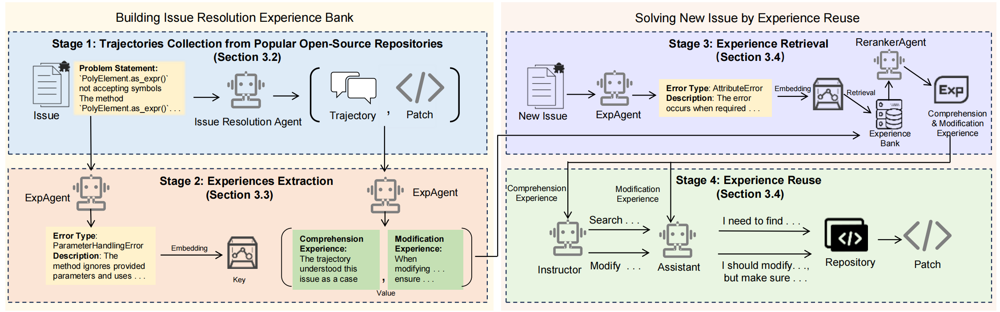

<div align="center">
  
</div>

# SWE-Exp
Code for paper: SWE-Exp: Experience-Driven Software Issue Resolution

A software engineering experimental framework based on Large Language Models (LLMs) for automated code repair and optimization, featuring experience learning and transfer capabilities.

## 📚 Table of Contents

<div align="center">
  
| Section | Description |
|---------|-------------|
| [🎯 Core: Experience Learning System](#-core-experience-learning-system) | Overview of the four-stage experience framework |
| [📊 Stage 1: Trajectories Collection](#-stage-1-trajectories-collection-from-popular-open-source-repositories) | Collection of resolution trajectories without experience guidance |
| [🔍 Stage 2: Experiences Extraction](#-stage-2-experiences-extraction) | Issue type extraction and trajectory experience mining |
| [🔎 Stage 3: Experience Retrieval](#-stage-3-experience-retrieval) | Two-phase experience selection and filtering |
| [🔧 Stage 4: Experience Reuse](#-stage-4-experience-reuse) | Application of retrieved experiences in new problem solving |
| [🏗️ Project Structure](#️-project-structure) | Repository organization and modules |
| [📋 Requirements](#-requirements) | Dependencies and environment setup |
| [🙏 Acknowledgements](#-acknowledgements) | Credits and references |

</div>

<div align="center">
  
  <p><em>Figure 1: SWE-Exp Method Overview - Four-Stage Experience-Driven Framework</em></p>
</div>

## 🎯 Core: Experience Learning System

The `moatless/experience` module implements a sophisticated four-stage experience-driven approach to software issue resolution:

1. **Stage 1**: Trajectories Collection from Popular Open-Source Repositories
2. **Stage 2**: Experiences Extraction (Issue Type Extraction + Trajectory Experience Mining)
3. **Stage 3**: Experience Retrieval 
4. **Stage 4**: Experience Reuse

## 📊 Stage 1: Trajectories Collection from Popular Open-Source Repositories

The first stage involves collecting resolution trajectories from popular open-source repositories **without using any prior experiences**. This creates a foundational dataset of problem-solving paths.

### Collection Process

```python
# Run the standard workflow without experience guidance
python workflow.py --instance_ids instance_id.txt --max_iterations 20

# This generates trajectory files without experience integration
# Trajectories are saved to: tmp_verified/trajectory/{instance_id}/
```

**Key Features:**
- **Pure Resolution Paths**: Collect trajectories without experience bias
- **Diverse Problem Types**: Gather data from various software engineering issues
- **Search Tree Format**: Store trajectories in structured SearchTree format
- **Multiple Attempts**: Capture both successful and failed resolution attempts

**Output:**
- Trajectory files in SearchTree format
- Resolution paths with action sequences
- Success/failure indicators
- Code modification records

## 🔍 Stage 2: Experiences Extraction

The second stage consists of two critical components that transform raw trajectories into structured, searchable knowledge.

### 2.1 Issue Type Extraction

**Purpose**: Extract issue types and descriptions as retrieval keys for experience matching.

```python
from moatless.experience.exp_agent.extract_verified_issue_types_batch import IssueAgent
from moatless.experience.prompts.exp_prompts import (
    issue_type_system_prompt,
    issue_type_user_prompt
)
from moatless.completion.completion import CompletionModel

# Initialize completion model
completion_model = CompletionModel(model="deepseek/deepseek-chat", temperature=0.7)

# Initialize issue type extractor
issue_agent = IssueAgent(
    completion=completion_model,
    system_prompt=issue_type_system_prompt,
    user_prompt=issue_type_user_prompt
)

# Extract issue types for instances
# python extract_verified_issue_types_batch.py --start 0 --end 100
```

**Key Features:**
- **Intelligent Classification**: Analyzes problem statements to extract issue types
- **Batch Processing**: Handles large datasets efficiently with resume capability
- **Structured Output**: Generates categorized issue type mappings
- **Semantic Keys**: Creates searchable keys for experience retrieval

### 2.2 Trajectory Experience Mining

**Purpose**: Extract reusable experiences and patterns from collected trajectories.

```python
from moatless.experience.exp_agent.exp_agent import ExpAgent
from moatless.experience.prompts.exp_prompts import (
    encode_success_perspective_system_prompt,
    encode_failed_perspective_system_prompt,
    encode_success_modify_system_prompt
)
from moatless.completion.completion import CompletionModel

# Initialize completion model
completion_model = CompletionModel(model="deepseek/deepseek-chat", temperature=0.7)

# Initialize experience generator
exp_agent = ExpAgent(
    completion=completion_model,
    success_per_system_prompt=encode_success_perspective_system_prompt,
    failed_per_system_prompt=encode_failed_perspective_system_prompt,
    success_mod_system_prompt=encode_success_modify_system_prompt,
    issue_type_path='<PROJECT_ROOT>/tmp/verified_issue_types_final.json'
)

# Process instance to extract experiences
exp_tree = {}
instance_id = "<INSTANCE_ID>"
tree_path = "<TRAJECTORY_PATH>/trajectory.json"
tree = SearchTree.from_file(tree_path)

# Extract perspective and modification experiences
rollout, patch = get_success_rollout_with_patch(tree, eval, False)
trajectory = get_trajectory(rollout)
perspective_exp = exp_agent.encode_perspective(instance_id, rollout=trajectory[0], patch=patch, flag='success')

rollout, patch = get_success_rollout_with_patch(tree, eval, True)
trajectory = get_trajectory(rollout)
modify_exp = exp_agent.encode_modify(instance_id, rollout=trajectory[0], patch=patch)
```

**Key Features:**
- **Dual Extraction**: Separates perspective insights and modification patterns
- **Success/Failure Analysis**: Different processing for successful vs. failed attempts
- **Trajectory Selection Criteria**: Shortest path for success, longest for failure
- **Structured Experience**: Converts trajectories into reusable knowledge base

**Generation Process:**
- **Trajectory Loading**: Load search tree trajectories from resolution attempts
- **Success/Failure Classification**: Determine outcome and select appropriate prompts
- **Pattern Extraction**: Extract both perspective insights and modification strategies
- **Experience Structuring**: Format into standardized experience objects
- **Knowledge Base Update**: Add new experiences to searchable repository

## 🔎 Stage 3: Experience Retrieval

The third stage implements a sophisticated two-phase experience selection system to identify the most relevant experiences for current problems.

### Two-Phase Experience Selection

#### Phase 1: Similarity-Based Filtering
**Automated Pre-filtering using Issue Type + Description Similarity**

```python
from moatless.experience.exp_agent.select_agent import SelectAgent
from moatless.experience.prompts.exp_prompts import (
    select_exp_system_prompt,
    select_exp_user_prompt
)

# Initialize experience selector
select_agent = SelectAgent(
    completion=completion_model,
    instance_id="<INSTANCE_ID>",
    select_system_prompt=select_exp_system_prompt,
    user_prompt=select_exp_user_prompt,
    exp_path='<PROJECT_ROOT>/tmp/verified_experience_tree.json',
    train_issue_type_path='<PROJECT_ROOT>/tmp/verified_issue_types_final.json',
    test_issue_type_path='<PROJECT_ROOT>/tmp/verified_issue_types_final.json',
    persist_dir=''
)

# Phase 1: Automatic similarity-based filtering (internal method)
# Phase 2: Agent evaluation and final selection
# old_experiences = select_agent.select_workflow(n=1)
id2score, topkids = select_agent.screening(pre_issues=issue_type_tmp, cur_issue={self.instance_id: test_issue_type[self.instance_id]})
```

**Similarity Matching Logic:**
- **Issue Type Alignment**: Match categorical problem types
- **Semantic Similarity**: Use `multilingual-e5-large-instruct` embeddings
- **Cosine Distance**: Calculate description similarity scores
- **Top-K Selection**: Return 10 most relevant candidates

#### Phase 2: Agent-Based Evaluation
**Intelligent Final Selection by LLM Agent**

```python
# The select_workflow method internally handles both phases:
# 1. Similarity-based filtering using issue types and embeddings
# 2. LLM agent evaluation for final selection

# Generate generalized experiences for current context
answer = select_agent.select_perspective(pre_issues=select_issues, cur_issue=cur_issue, k=n)
```

**Agent Evaluation Process:**
- **Context Analysis**: Deep understanding of current problem
- **Experience Assessment**: Evaluate relevance and applicability
- **Strategy Selection**: Choose most promising comprehension experiences
- **Confidence Scoring**: Rank experiences by expected effectiveness

## 🔧 Stage 4: Experience Reuse

The fourth stage applies retrieved experiences to guide the resolution of new software issues, integrating them into the search tree process.

### Experience Integration in Problem Solving

```python
# Main workflow with experience integration
python workflow.py --instance_ids instance_id.txt --experience --max_iterations 20
```

### Search Tree Experience-Driven Process

The search tree implements a sophisticated four-stage iterative process that incorporates retrieved experiences:

1. **🎯 Selection Stage**
   - **Experience-Guided Node Selection**: Choose promising leaf nodes based on experience insights
   - **Strategy**: Balance between exploitation of high-value paths and exploration guided by past experiences
   - **Criteria**: Incorporate experience-based heuristics for node selection

2. **🔄 Expansion Stage**
   - **Experience-Informed Action Generation**: Generate actions using insights from retrieved experiences
   - **Action Guidance**: Use perspective experiences to inform action planning
   - **Context Integration**: Apply modification experiences to suggest specific code changes

3. **📊 Evaluation Stage**
   - **Experience-Enhanced Value Assessment**: Evaluate actions considering past success patterns
   - **Feedback Integration**: Incorporate both real-time feedback and historical lessons
   - **Pattern Recognition**: Identify similar scenarios from experience base

4. **🏆 Discrimination Stage**
   - **Experience-Informed Consensus**: Use multi-agent evaluation enhanced by historical insights
   - **Quality Assurance**: Apply learned quality criteria from past successful resolutions
   - **Trajectory Selection**: Choose paths that align with proven successful patterns

### Usage Examples

#### Complete Four-Stage Pipeline Execution

```bash
# Stage 1: Collect trajectories from repositories (without experience)
python workflow.py --instance_ids instance_id.txt --max_iterations 20

# Stage 2: Extract experiences from collected trajectories
# 2.1: Extract issue types
python moatless/experience/exp_agent/extract_verified_issue_types_batch.py \
  --start 0 --end 500

# 2.2: Mine trajectory experiences
python moatless/experience/exp_agent/exp_agent.py

# Stage 3 & 4: Run experience-driven resolution (retrieval + reuse)
python workflow.py --instance_ids instance_id.txt --experience --max_iterations 20
```

#### Main Workflow Parameters

```bash
# Basic usage without experience (Stage 1)
python workflow.py --instance_ids instance_id.txt

# Experience-driven resolution (Stage 3 & 4)
python workflow.py --instance_ids instance_id.txt --experience

# Advanced usage with custom parameters
python workflow.py \
  --instance_ids instance_id.txt \
  --max_iterations 20 \
  --max_finished_nodes 3 \
  --max_expansions 3 \
  --experience
```

**Parameters:**
- `--instance_ids`: Path to text file containing instance IDs (one per line)
- `--max_iterations`: Maximum number of search tree iterations (default: 10)
- `--max_finished_nodes`: Maximum number of completed solution nodes (default: 3)  
- `--max_expansions`: Maximum number of expansions per state (default: 3)
- `--experience`: Enable experience-driven resolution (Stages 3 & 4)
  - **Without `--experience`**: Stage 1 - Pure trajectory collection
  - **With `--experience`**: Stages 3 & 4 - Experience retrieval and reuse

**Input Format:**
Create an `instance_id.txt` file with one instance ID per line:
```
django__django-12345
flask__flask-6789
requests__requests-1011
```

**Output:**
- **Stage 1**: Trajectory files saved to `tmp_verified/trajectory/{instance_id}/`
- **Stage 2**: Experience files saved to `tmp_verified/experience/{instance_id}/`
- **Stage 3 & 4**: Enhanced prediction results in `prediction_verified.jsonl`

## 🏗️ Project Structure

```
SWE-Exp/
├── workflow.py                           # Main execution pipeline (all stages)
├── moatless/
│   ├── experience/                      # 🎯 Experience learning core (Stages 2-4)
│   │   ├── exp_agent/                  # Experience processing agents
│   │   │   ├── extract_verified_issue_types_batch.py  # Stage 2.1: Issue classification
│   │   │   ├── select_agent.py         # Stage 3: Experience retrieval
│   │   │   └── exp_agent.py            # Stage 2.2: Experience generation
│   │   ├── prompts/                    # Instruction templates
│   │   │   ├── exp_prompts.py          # Experience selection prompts
│   │   │   └── agent_prompts.py        # Agent interaction prompts
│   │   ├── instructor.py               # Stage 4: Guidance generation
│   │   └── get_save_json.py            # Data persistence utilities
│   ├── actions/                        # Code operation primitives
│   ├── agent/                          # Multi-agent framework
│   ├── search_tree.py                  # Stage 1 & 4: Tree search optimization
│   └── ...                             # Other modules
└── verified_dataset_ids.txt             # Verified test instances
```

## 📋 Requirements

Dependencies and environment setup details has been specifed in requirements.txt.

## 🙏 Acknowledgements

We would like to thank Albert Örwall for open-sourcing SWE-Search, which serves as the foundation for our framework, SWE-Exp. This framework is built upon and references the excellent work at [@aorwall/moatless-tree-search](https://github.com/aorwall/moatless-tree-search).
